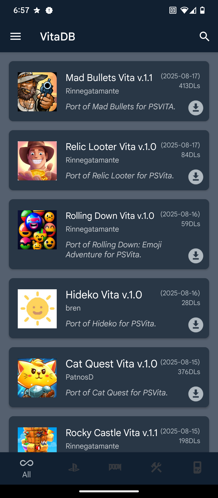
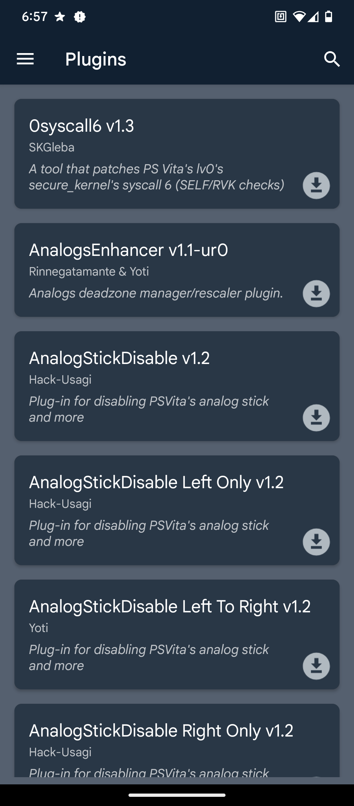
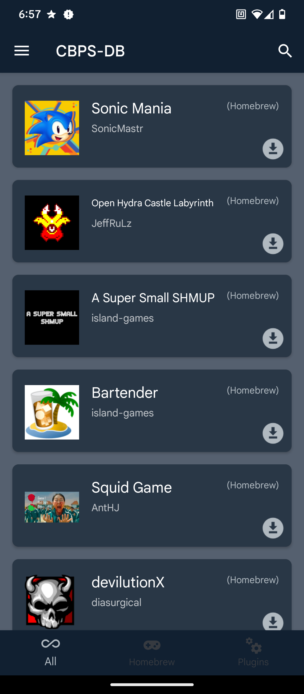
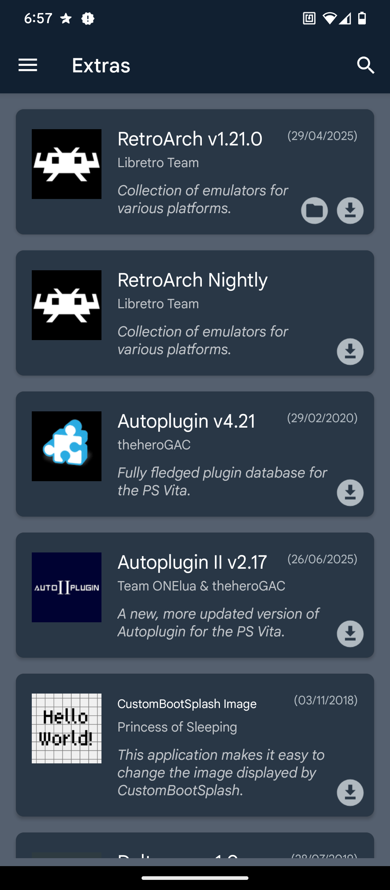
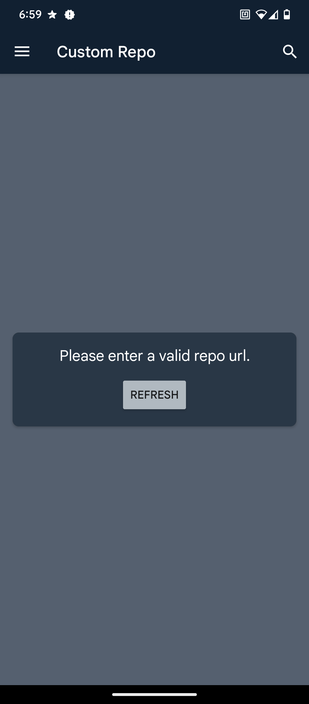
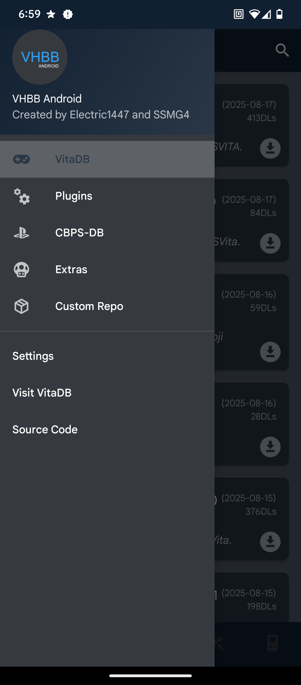
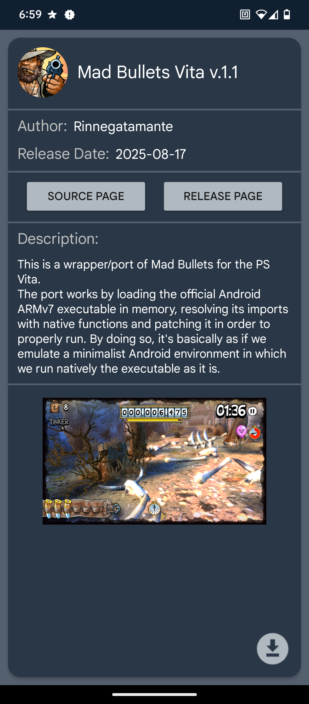

# VHBB-Android Revived
- Latest Update: 2025.08.21
- Latest Version: stable-2


### To Do
- [X] Update The Source Code
- [X] Add More Features (Gradually)
- [X] Update The Plugins Database

### Information
A PS Vita Homebrew Browser client for Android with great potential

### Features
- VitaDB page containing all its homebrews.
- Custom plugin database containing over 95% of all the PS Vita plugins.
- CBPS-DB page containing all its homebrews & plugins.
- Custom Extras page featuring some cool extras for your PS Vita/PS TV.
- Download homebrews & plugins to your Android device.
- Search for homebrews & plugins.
- Custom repository support.
- Feature to clear cache by pressing a button.
- Choose a custom download location if needed.

### Requirements
- Android device running Android 5.0 Lolipop or higher.
- An Internet connection.

### Building
>[!WARNING]
>The source code assumes you have the same requirements and environment as myself, SSMG4, which includes:
>- Eclispe Adotium's JDK 17 (Or ideally any JDK 17 environments)
>- Gradle 7.6.4 (automatically installed by Gradlew.bat or Android Studio)
>- 4-6GB RAM minimum
>- Have Android SDK installed and located in D:
>- Are running Windows or UNIX (preferably Windows 10-11 or for UNIX preferably Ubuntu 22.04 LTS/OS X 11-12)
>If not, this tutorial will help you setup the right environment and requirements.
#### Windows Using Gradlew.bat
- Open Windows Command Prompt
- Clone the repository using Git:
```git clone https://github.com/SSMG4/VHBB-Android-Revived.git```
- Open File Explorer
- Navigate to where ```\VHBB-Android-Revived\``` is located
- Open the file ```local.properties```
- Edit ```sdk.dir=D:\\AppData\\Android\\Sdk``` to match the location of your Android SDK
- Save your changes, then open ```gradle.properties```
- Edit ```org.gradle.java.home=D:/Programs/Eclipse Adoptium/jdk-17.0.16.8-hotspot``` to match the location of your Java environment
- Save your changes, and now back to the Command Prompt
- Go to the directory using cd:
```cd VHBB-Android-Revived```
- Compile the app using Gradlew.bat:
```gradlew.bat AssembleDebug```
- Wait for it to compile and say:
```bash
BUILD SUCCESSFUL in 50s // The time depends on your environment.
28 actionable tasks: 28 executed
```
- Once done, the APK generated should be outputed to: ```...\VHBB-Android-Revived-master\app\build\outputs\apk\debug```
- You can now transfer this APK to your phone and install the app!

#### UNIX Using Gradlew
- Open your **Terminal**
- Clone the repository using Git: 
```git clone https://github.com/SSMG4/VHBB-Android-Revived.git```
- Navigate to the project folder: 
```cd VHBB-Android-Revived```
- Open the file `local.properties` with your preferred editor (e.g. nano, vim, or VS Code):
```nano local.properties```
- Edit the Android SDK path. On UNIX, paths use `/` instead of `\`. Example:
```properties
sdk.dir=/home/username/Android/Sdk
```
*(replace `username` with your actual system username and point it to your installed SDK location)*

- Save your changes, then edit `gradle.properties`:
```nano gradle.properties```

- Update the Java home path to your JDK installation. Example:

```properties
org.gradle.java.home=/usr/lib/jvm/jdk-17
```

*(verify this path with `echo $JAVA_HOME` or `readlink -f $(which java)`)*

- Save and exit.

- Back in the terminal, build the project using the Gradle wrapper script (`gradlew` instead of `gradlew.bat`):
```./gradlew assembleDebug```
- Wait for the build to complete. If successful, you should see something like:
```bash
BUILD SUCCESSFUL in 50s // time depends on your environment
28 actionable tasks: 28 executed
```
- The compiled APK will be located in:
```.../VHBB-Android-Revived/app/build/outputs/apk/debug/```
- Transfer the APK to your Android device and install it 

---

Tip: if you get `Permission denied` running `./gradlew`, you may need to make it executable first:
```chmod +x gradlew```


### Screenshots
 &nbsp;  &nbsp;  &nbsp;  &nbsp;  &nbsp;  &nbsp; 

### Notes
- If a new update to the extras or the plugins page is up, its best that you wait for the app to fetch it while can take about 1-5 minutes.

### Credits
- [Electric1447](https://github.com/Electric1447) - For creating the project
- [SSMG4](https://github.com/SSMG4) - For reviving the project
- [Original Project](https://github.com/Electric1447/VHBB-Android)
